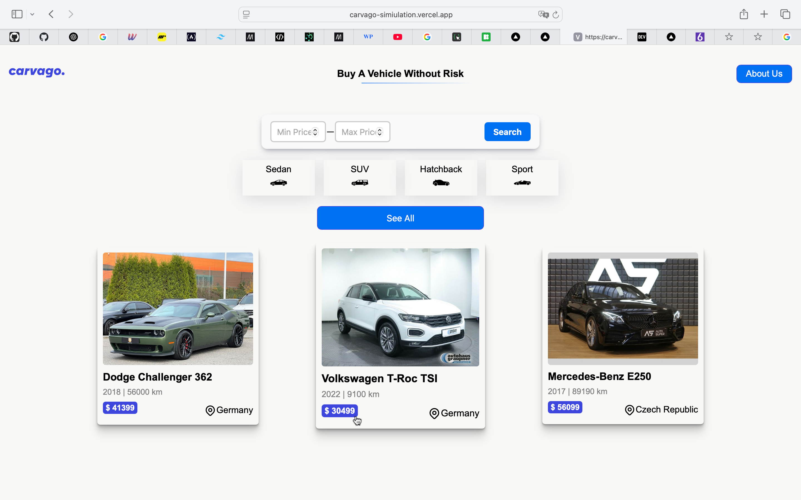
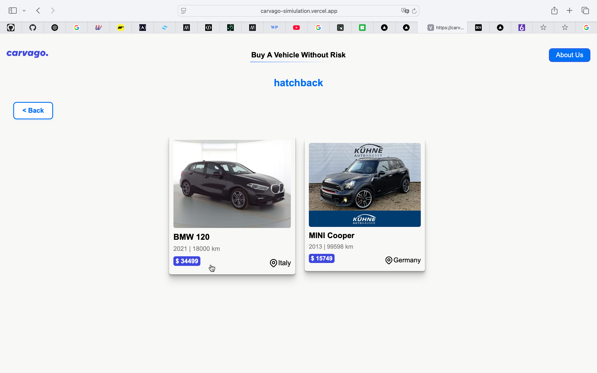
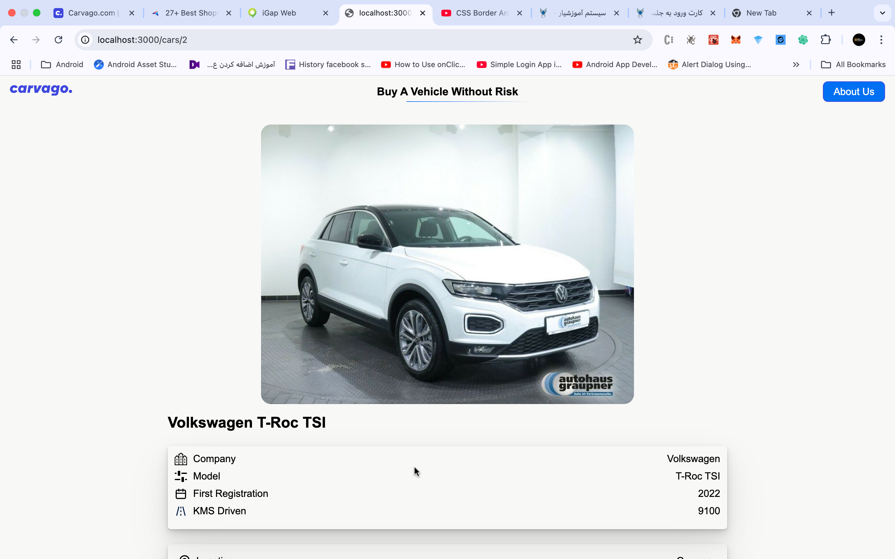
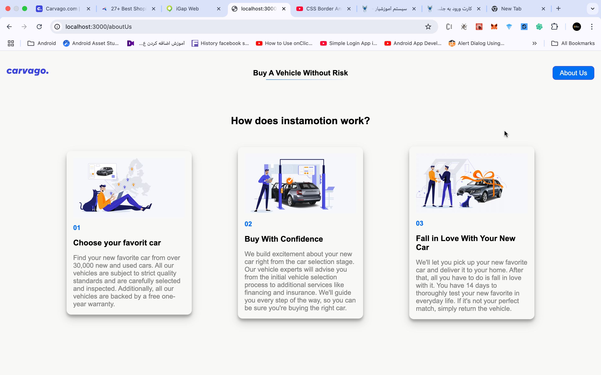

# Carvago Simulation

🚗 A front-end simulation of the Carvago.com platform — designed for practicing UI/UX, layout, and web design principles using Next.Js

[🔗 Live Demo](https://carvago-simiulation.vercel.app)

---

## ✨ Features

- Sleek, modern design
- Responsive layout for desktop & mobile
- Search cars with min and max price
- search cars with categories
- see all cars
- cars detail page
- Fully deployed and accessible via Vercel

---

## 🖼️ Screenshots

### 🔹 Homepage

### 🔹 category page

### 🔹 car detail page

### 🔹 About Page

---

## 🛠️ Tech Stack

- HTML5
- CSS3
- Js
- Next.Js
- Hosted on [Vercel](https://vercel.com)

---

## 🔗 Connect With Us

We’d love to hear from you! Reach out through:

- 📸 [Instagram](https://instagram.com/alrzajahangiri)
- ✉️ [Telegram](https://t.me/AlirezaJHG)
